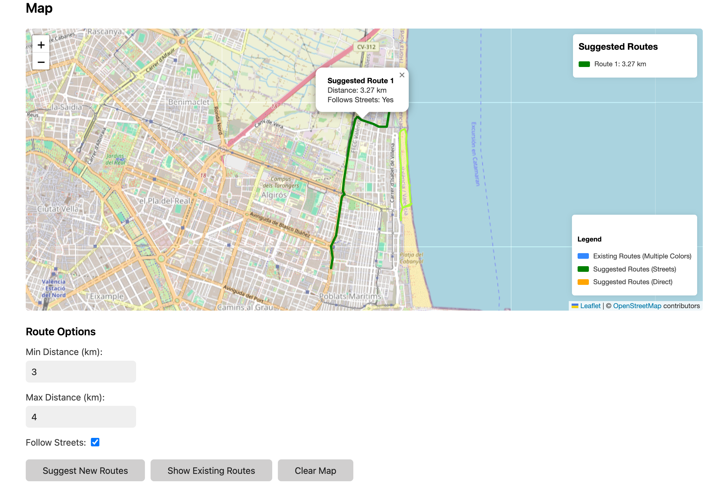

# Walk Assistant

Walk Assistant is a web-based tool that helps you explore your neighborhood by suggesting new walking routes based on your previous walks. Upload your GPX tracks, and the application will analyze them to suggest routes that take you to areas you haven't explored yet.

## Features

- **Upload GPX Files**: Easily upload GPX tracks from your walks
- **Visualize Routes**: See your existing routes on an interactive map with different colors for each route
- **Discover New Routes**: Get suggestions for new routes that help you explore unexplored areas
- **Filter Routes**: Filter suggested routes based on minimum and maximum distance
- **Street-Following Routes**: Generate routes that follow actual streets and paths
- **Distance Constraints**: Set minimum and maximum distance limits for your walks
- **Route Randomization**: Get varied route suggestions each time you use the app

## Screenshots



The screenshot shows the Walk Assistant web interface with the map displaying routes and the controls for generating new routes.

## Getting Started

### Prerequisites

- Docker or Podman for running the containerized application
- A web browser to access the user interface

### Installation

#### Using Docker/Podman

```bash
# Pull the image from GitHub Container Registry
docker pull ghcr.io/korjavin/walkassistant:latest

# Run the container
docker run -p 8080:8080 -v $(pwd)/data:/app/data ghcr.io/korjavin/walkassistant:latest
```

#### Building from Source

```bash
# Clone the repository
git clone https://github.com/korjavin/walkassistant.git
cd walkassistant

# Build the application
go build -o walkassistant ./backend

# Run the application
./walkassistant
```

### Usage

1. Open your web browser and navigate to `http://localhost:8080`
2. Use the upload form to upload your GPX files
3. View your existing routes on the map
4. Click "Suggest New Routes" to get recommendations for new walking routes
5. Use the distance filters to customize the suggested routes

## Development

### Project Structure

- `backend/`: Go server code
- `frontend/`: HTML, CSS, and JavaScript files
- `data/`: Directory for storing uploaded GPX files
- `Dockerfile`: For containerizing the application
- `.github/workflows/`: GitHub Actions workflows for CI/CD

### Technologies Used

- **Backend**: Go
- **Frontend**: HTML, JavaScript, Leaflet.js
- **CSS Framework**: Water.css (minimal CSS framework)
- **Map**: OpenStreetMap via Leaflet.js
- **Routing**: OSRM (Open Source Routing Machine) API for street-following routes
- **Containerization**: Docker/Podman
- **CI/CD**: GitHub Actions

## Contributing

Contributions are welcome! Please feel free to submit a Pull Request.

1. Fork the repository
2. Create your feature branch (`git checkout -b feature/amazing-feature`)
3. Commit your changes (`git commit -m 'Add some amazing feature'`)
4. Push to the branch (`git push origin feature/amazing-feature`)
5. Open a Pull Request

## License

This project is licensed under the MIT License - see the LICENSE file for details.

## Acknowledgments

- [gpxgo](https://github.com/tkrajina/gpxgo) - Go library for GPX file parsing
- [Leaflet.js](https://leafletjs.com/) - JavaScript library for interactive maps
- [OpenStreetMap](https://www.openstreetmap.org/) - Map data
- [OSRM](http://project-osrm.org/) - Open Source Routing Machine for street-following routes
- [Water.css](https://watercss.kognise.dev/) - Minimal CSS framework

## Recent Updates

- **Route Generation Improvements**: Added better handling of OSRM API limits (max 500 waypoints)
- **Minimum Distance Routes**: Improved algorithm for generating routes that meet minimum distance requirements
- **Street Following**: Enhanced street-following capabilities for extended routes
