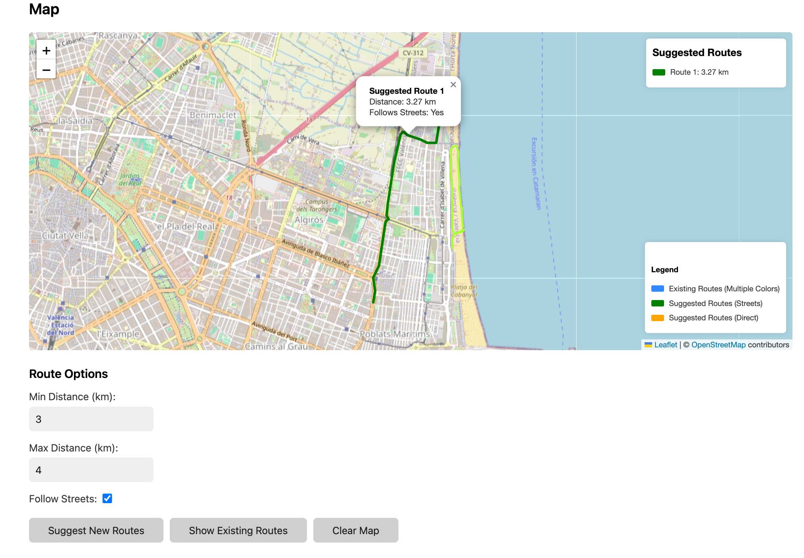

# Walk Assistant

Walk Assistant is a web-based tool that helps you explore your neighborhood by suggesting new walking routes based on your previous walks. Upload your GPX tracks, and the application will analyze them to suggest routes that take you to areas you haven't explored yet.

## Features

- **🔐 Google Authentication**: Secure login with your Google account
- **👤 User Privacy**: Each user sees only their own routes - complete data isolation
- **📤 Upload GPX Files**: Easily upload GPX tracks from your walks
- **🗺️ Visualize Routes**: See your existing routes on an interactive map with different colors for each route
- **🔍 Discover New Routes**: Get suggestions for new routes that help you explore unexplored areas
- **📏 Filter Routes**: Filter suggested routes based on minimum and maximum distance
- **🛣️ Street-Following Routes**: Generate routes that follow actual streets and paths
- **⚙️ Distance Constraints**: Set minimum and maximum distance limits for your walks
- **🎲 Route Randomization**: Get varied route suggestions each time you use the app
- **💾 Persistent Storage**: Routes are stored in a SQLite database for reliability

## Screenshots



The screenshot shows the Walk Assistant web interface with the map displaying routes and the controls for generating new routes.

## Privacy & Self-Hosting

GPX files contain detailed information about your walking routes and habits, which can be considered sensitive personal data. This information reveals your location patterns and could be a privacy concern if shared with third parties.

Walk Assistant is designed with privacy in mind:

- **Self-hosted solution**: Run the application on your local computer or within your trusted network
- **User authentication**: Google OAuth ensures only you can access your routes
- **Data isolation**: Each user's routes are completely isolated from other users
- **No external services**: Your GPX data never leaves your control (except for OpenStreetMap for map display and optional OSRM routing)
- **No tracking**: No analytics or tracking code is included
- **Data ownership**: You maintain complete ownership and control of your data
- **Local processing**: All route analysis and suggestions happen locally
- **Encrypted sessions**: Secure cookie-based sessions with AES-256 encryption

We strongly recommend self-hosting this application rather than using cloud-hosted alternatives that might compromise your location privacy. This approach ensures your personal movement data remains private and secure.

**Note**: While the application uses Google OAuth for authentication, your route data is never sent to Google. Only your Google account ID is used to identify you within the app.

## Getting Started

### Prerequisites

- Docker or Podman for running the containerized application
- A Google account for authentication
- Google OAuth credentials (see [SETUP.md](SETUP.md) for details)
- A web browser to access the user interface

### Quick Start

**Important**: Before running the application, you need to set up Google OAuth authentication. See [SETUP.md](SETUP.md) for detailed instructions.

Required environment variables:
- `GOOGLE_CLIENT_ID` - Your Google OAuth client ID
- `GOOGLE_CLIENT_SECRET` - Your Google OAuth client secret
- `GOOGLE_REDIRECT_URL` - OAuth callback URL (e.g., `http://localhost:8080/auth/google/callback`)
- `COOKIE_HASH_KEY` - 64-byte hex key for cookie encryption
- `COOKIE_BLOCK_KEY` - 32-byte hex key for cookie encryption

### Installation

#### Using Docker/Podman

```bash
# Pull the image from GitHub Container Registry
docker pull ghcr.io/korjavin/walkassistant:latest

# Run the container (with required environment variables)
docker run -p 8080:8080 \
  -v $(pwd)/data:/app/data \
  -e GOOGLE_CLIENT_ID="your-client-id" \
  -e GOOGLE_CLIENT_SECRET="your-secret" \
  -e GOOGLE_REDIRECT_URL="http://localhost:8080/auth/google/callback" \
  -e COOKIE_HASH_KEY="your-64-byte-hash-key" \
  -e COOKIE_BLOCK_KEY="your-32-byte-block-key" \
  ghcr.io/korjavin/walkassistant:latest
```

Or use Docker Compose (see `deployments/docker-compose.yml` and create a `.env` file).

#### Building from Source

```bash
# Clone the repository
git clone https://github.com/korjavin/walkassistant.git
cd walkassistant

# Build the application
go build -o walkassistant ./backend

# Run the application
./walkassistant
```

### Usage

1. Open your web browser and navigate to `http://localhost:8080`
2. **Log in with your Google account** (required for first-time users)
3. Once authenticated, you'll see the main application interface
4. Use the upload form to upload your GPX files
5. View your existing routes on the map (only your routes are visible)
6. Click "Suggest New Routes" to get recommendations for new walking routes
7. Use the distance filters to customize the suggested routes
8. Click "Logout" when you're done

**Note**: Your routes are private and only visible to you. Each user has their own isolated storage.

## Development

### Project Structure

- `backend/`: Go server code
- `frontend/`: HTML, CSS, and JavaScript files
- `data/`: Directory for storing uploaded GPX files
- `Dockerfile`: For containerizing the application
- `.github/workflows/`: GitHub Actions workflows for CI/CD

### Technologies Used

- **Backend**: Go
- **Frontend**: HTML, JavaScript, Leaflet.js
- **CSS Framework**: Water.css (minimal CSS framework)
- **Map**: OpenStreetMap via Leaflet.js
- **Routing**: OSRM (Open Source Routing Machine) API for street-following routes
- **Containerization**: Docker/Podman
- **CI/CD**: GitHub Actions

## Contributing

Contributions are welcome! Please feel free to submit a Pull Request.

1. Fork the repository
2. Create your feature branch (`git checkout -b feature/amazing-feature`)
3. Commit your changes (`git commit -m 'Add some amazing feature'`)
4. Push to the branch (`git push origin feature/amazing-feature`)
5. Open a Pull Request

## License

This project is licensed under the MIT License - see the LICENSE file for details.

## Acknowledgments

- [gpxgo](https://github.com/tkrajina/gpxgo) - Go library for GPX file parsing
- [Leaflet.js](https://leafletjs.com/) - JavaScript library for interactive maps
- [OpenStreetMap](https://www.openstreetmap.org/) - Map data
- [OSRM](http://project-osrm.org/) - Open Source Routing Machine for street-following routes
- [Water.css](https://watercss.kognise.dev/) - Minimal CSS framework

## Recent Updates

- **Route Generation Improvements**: Added better handling of OSRM API limits (max 500 waypoints)
- **Minimum Distance Routes**: Improved algorithm for generating routes that meet minimum distance requirements
- **Street Following**: Enhanced street-following capabilities for extended routes
